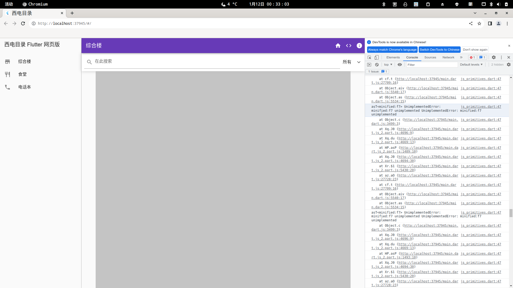

# xidian_directory

Xidian Directory Flutter App, a revisit of a project I participated at the darkest time in 2022.

Warning: Due to the lazy loading support, web support only.

Compile it with the following command:

```bash
flutter build web --profile --dart-define=Dart2jsOptimization=O4
```

This will compile the project with the profile setting, which optimizing the code with O4 setting (default is O1), code not zipped, and performance analyze support. 

Why not release? Because I encounter this bug...



I have no idea why this happen.

Refer to:  
* [Original Site](https://ncov.hawa130.com/about)
* [Original Code by hawa130](https://github.com/hawa130/Xidirectory)
* [My Page about that time](https://benderblog.github.io/SpiritFlown.html)
